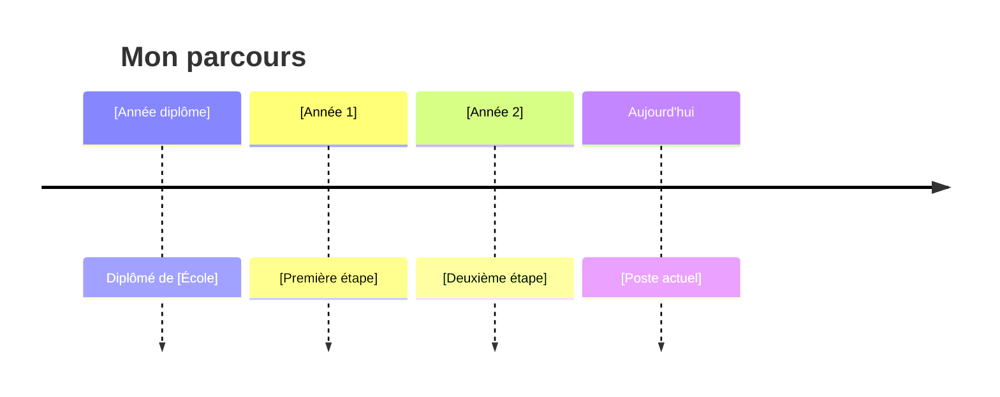

    

      <h1>Mon parcours</h1>
      

      <strong>Ewen ROULOIS</strong>
      
Ingénieur Cloud Azure

    

    

      
Promo 2021

      
    

---
layout: image-left

# the image source
image: /images/DSC06369.jpg
---

# 🙋🏻‍♂️ Qui suis-je ?

<ul>
  <li v-click>passionné de dev</li>
  <li v-click>passionné d'infra</li>
  <li v-click>passionné d'automatisation</li>
</ul>

    Ingénieur Cloud chez Orange Business, spécialisé dans les solutions Microsoft Azure depuis environ 1 an et demi.

<!-- 

  Alternance chez Orange Business pendant 2 ans et demi avec ensuite une embauche en CDI.

 -->

<!-- 

  Comme quoi les dev peuvent et doivent faire de l'infra 😄

 -->

---

# 📚 Formations

  

    

      
    

    

      BAC STI2D (ITEC)
    

    <ul>
      <li>Mécanique industrielle</li>
      <li>Énergie</li>
      <li>Éco-conception</li>
    </ul>
    
  

  

    

      
    

    

      BTS SIO (SLAM)
    

    <ul>
      <li>Dev back, web et mobile</li>
      <li>SQL & base de données</li>
      <li>Réseau & système</li>
    </ul>
    
      Mais aussi
    
    <ul>
      <li>Algorithmique</li>
      <li>Du légal (RGPD, CNIL...)</li>
      <li>...</li>
    </ul>
  

  

    

      
    

    

      MSc Pro Epitech (Cloud)
    

    <ul>
      <li>Gestion de projet</li>
      <li>Cybersécurité</li>
      <li>Cloud</li>
    </ul>
  

<!--

  Alternance chez Orange Business pendant 2 ans et demi avec ensuite une embauche en CDI.

-->

---
theme: default
background: https://source.unsplash.com/collection/94734566/1920x1080
class: text-center
highlighter: shiki
lineNumbers: false
info: |
  ## Présentation de parcours
drawings:
  persist: false
transition: slide-left
title: Mon parcours depuis [Nom de l'école]
---

# [Ton Nom]

[Ton poste actuel]

[Ton entreprise/organisation]

Promo [Année]

---
layout: center
---

# En [année], je pensais devenir X...

## Aujourd'hui je fais complètement autre chose

  Et c'est la meilleure décision que j'ai prise

---
layout: image-right
image: /path/to/your/student-photo.jpg
---

# Moi, étudiant

<v-clicks>

- 📚 Filière : [Ta filière/spécialité]
- 🎯 Projets marquants : [Projet 1, Projet 2]
- 💭 Mon état d'esprit à l'époque :
  - "Je voulais..."
  - "Mes questions étaient..."

</v-clicks>

---
layout: image-right
image: /path/to/your/current-photo.jpg
---

# Moi, aujourd'hui

<v-clicks>

- 💼 **[Ton poste]** chez [Entreprise]
- 🚀 Ce que je fais : [Description en 1-2 lignes]
- ⏱️ Depuis [X années/mois]

</v-clicks>

---
layout: center
---

# Le chemin parcouru

  Voici comment j'en suis arrivé là...

---
